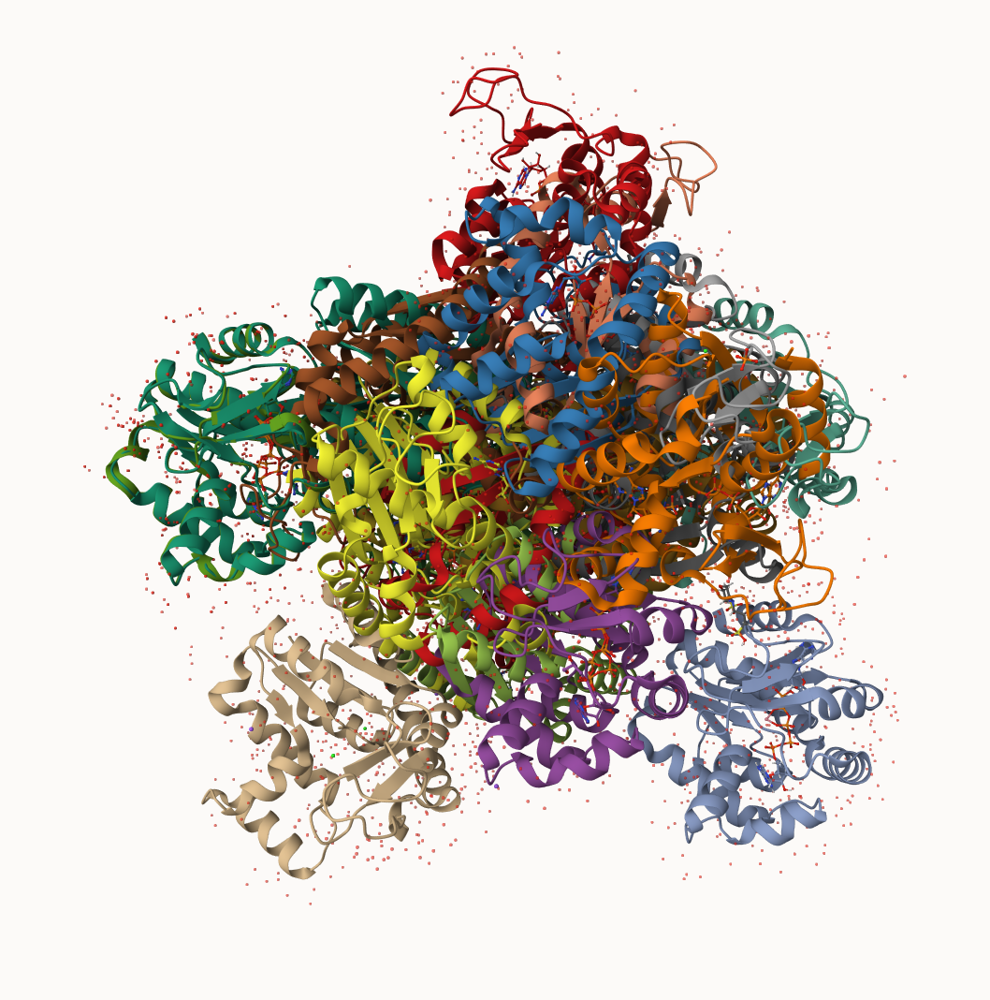

## Comparative analysis with PCA

First step, find ADK seq:

```{r}
library(bio3d)

id <- "1ake_A"
aa <- get.seq(id)
```

```{r}
aa
```

Next step: Search PDB database for all related entries (use BLAST):

```{r}
b <- blast.pdb(aa)
hits <- plot(b)
```

BLAST hits for us to see:

```{r}
head(b$hit.tbl)
```

Top hits are in the hits object. now we can download these to our computer. Put results in a sub folder claled "pbds":

```{r}
# Download releated PDB files
files <- get.pdb(hits$pdb.id, path="pdbs", split=TRUE, gzip=TRUE)

```

Hot mess multiple protein viz:



##Align and superpose structures

Next we will use the pdbaln() function to align and also optionally fit (i.e. superpose) the identified PDB structures.

Ensure to install all packages before using:
```{r}
#| results: hide
#| fig-show: hide
#| message: false
#| warning: false

library(bio3d)
# Align releated PDBs
pdbs <- pdbaln(files, fit = TRUE, exefile="msa")
```

we could view pdb objects in R with **bio3dview** `view.pdbs()`:

```{r}
library(bio3dview)

view.pdbs(pdbs, colorScheme = "residue")
```

## Annotate collected PDB structures

```{r}
# Vector containing PDB database codes
ids <- basename.pdb(pdbs$id)

anno <- pdb.annotate(ids)
unique(anno$source)
```

## PCA

Run PCA on pdb objects using `pca()` function:
```{r}
# Perform PCA
pc.xray <- pca(pdbs)
plot(pc.xray)
```

### PCA visualization

To visualize the major structural variations in the ensemble the function mktrj() can be used to generate a trajectory PDB file by interpolating along a give PC (eigenvector):

```{r}
# Visualize first principal component
pc1 <- mktrj(pc.xray, pc=1, file="pc_1.pdb")
```

