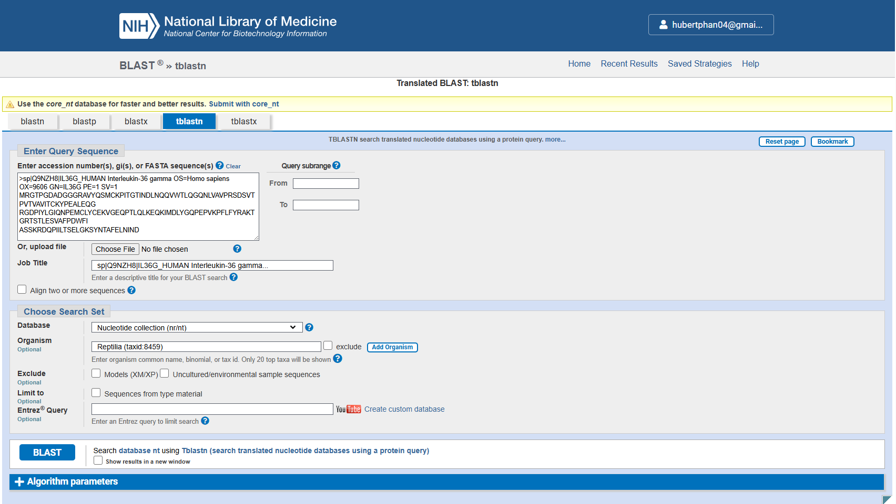
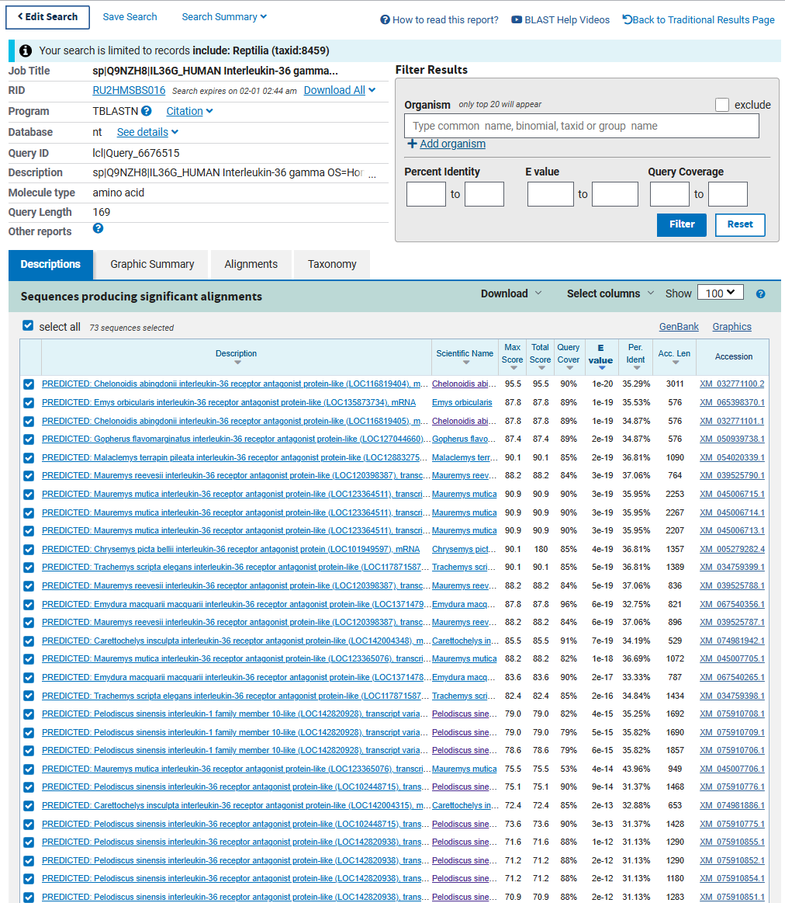
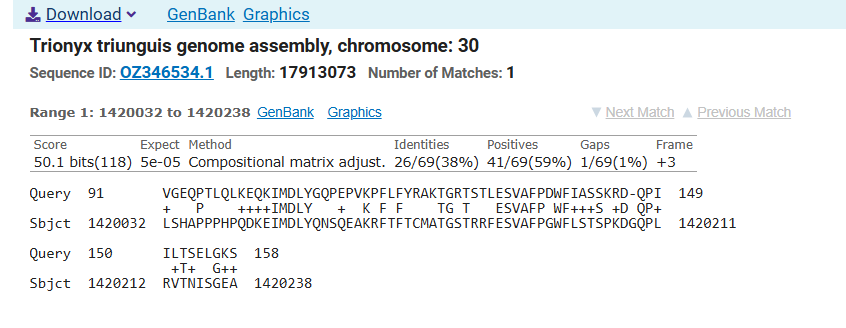
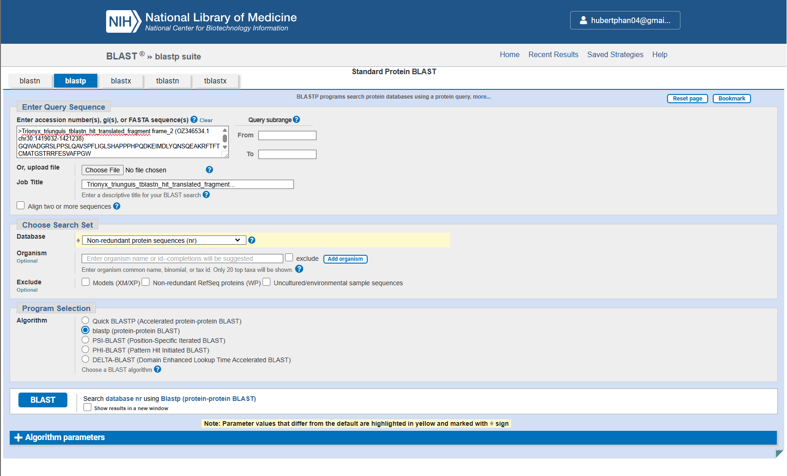
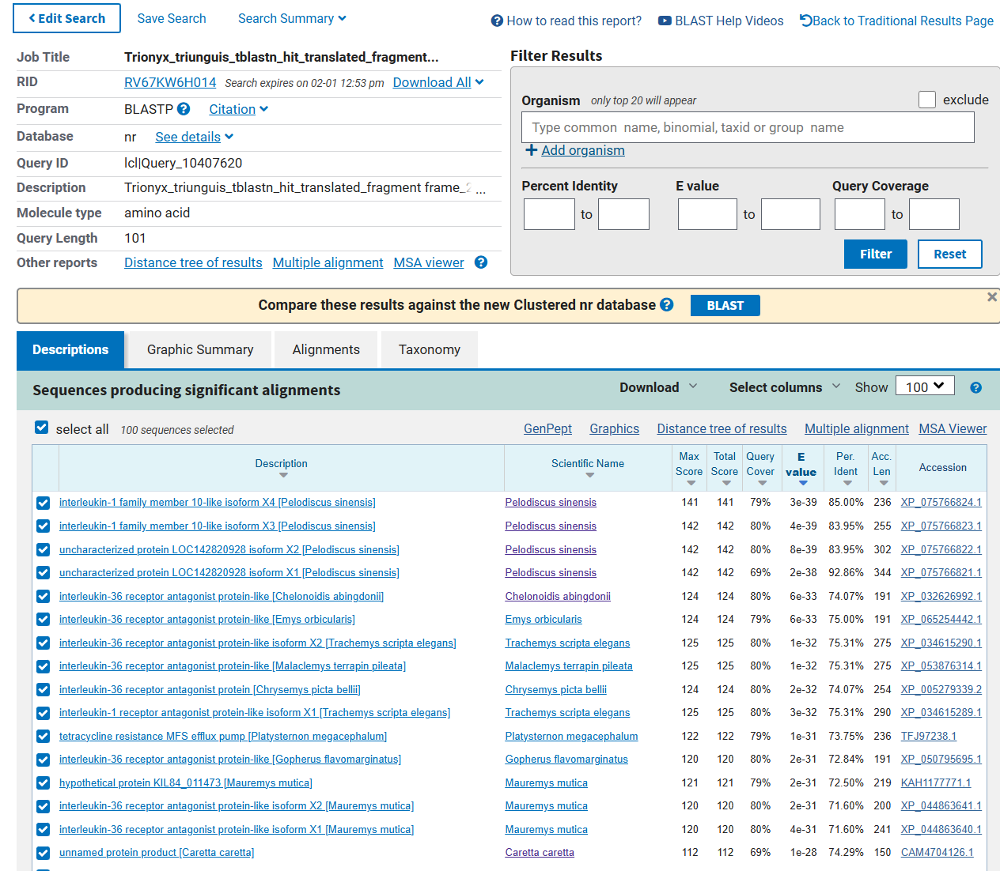
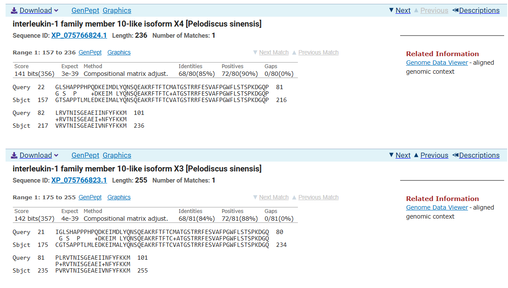
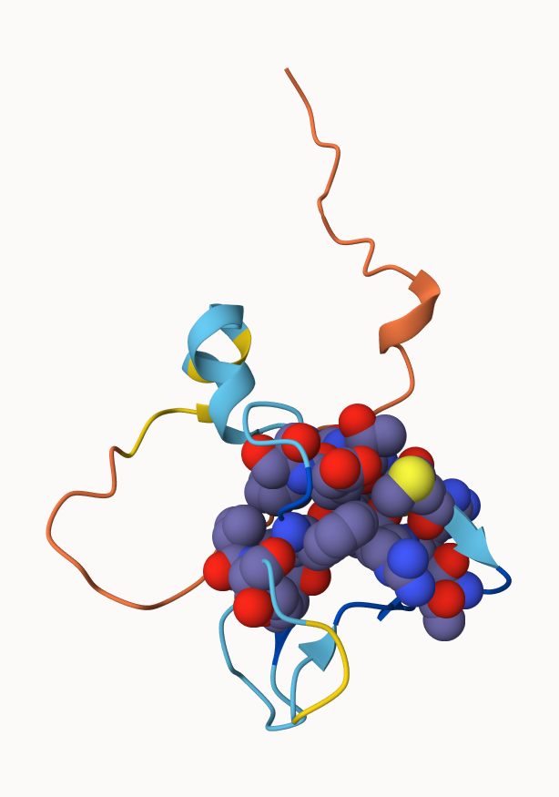
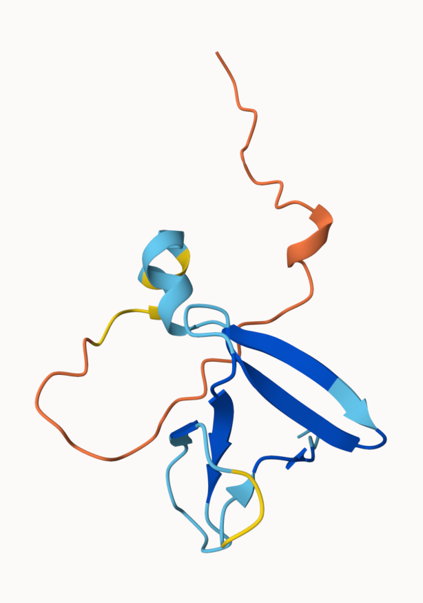
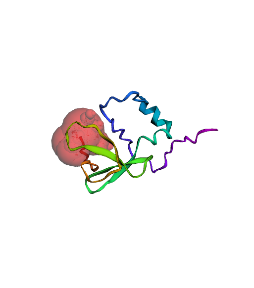

# Find a Gene Assignment
Hubert Phan (PID: A17663330)

> **Q1.** Tell me the name of a protein you are interested in. Include
> the species, accession number and known function. This can be a human
> protein or a protein from any other species as long as it’s function
> is known.  
> If you do not have a favorite protein, select human RBP4 or KIF11. Do
> not use beta globin as this is in the worked example report that I
> provide you with online.

**Name:** Interleukin-36 gamma (IL36G)

**Species:** Homo sapiens

**Accession:** Q9NZH8

**Function:** Interleukin-36 gamma (IL36G) plays a role in skin
inflammation and immune signaling. IL36G is associated in skin disorders
such as psoriasis and dandruff.

> **Q2.** Perform a BLAST search against a DNA database, such as a
> database consisting of genomic DNA or ESTs. The BLAST server can be at
> NCBI or elsewhere. Include details of the BLAST method used, database
> searched and any limits applied (e.g. Organism).

**Method:** TBLASTN search against reptilia nt

**Database:** Nucleotide collection (nt)

**Organsim:** Reptilia (taxid:8459)

> Also include the output of that BLAST search in your document. If
> appropriate, change the font to Courierdd size 10 so that the results
> are displayed neatly. You can also screen capture a BLAST output
> (e.g. alt print screen on a PC or on a MAC press ⌘-shift-4. The
> pointer becomes a bulls eye. Select the area you wish to capture and
> release. The image is saved as a file called Screen Shot \[\].png in
> your Desktop directory). It is not necessary to print out all of the
> blast results if there are many pages.



> On the BLAST results, clearly indicate a match that represents a
> protein sequence, encoded from some DNA sequence, that is homologous
> to your query protein. I need to be able to inspect the pairwise
> alignment you have selected, including the E value and score. It
> should be labeled a “genomic clone” or “mRNA sequence”, etc. - but
> include no functional annotation.

**Chosen Match:** Accession OZ346534.1, Trionyx triunguis genome
assembly. See alignment details below.





> In general, \[Q2\] is the most difficult for students because it
> requires you to have a “feel” for how to interpret BLAST results. You
> need to distinguish between a perfect match to your query (i.e. a
> sequence that is not “novel”), a near match (something that might be
> “novel”, depending on the results of \[Q4\]), and a non-homologous
> result.  
> If you are having trouble finding a novel gene try restricting your
> search to an organism that is poorly annotated.

> **Q3.** Gather information about this “novel” protein. At a minimum,
> show me the protein sequence of the “novel” protein as displayed in
> your BLAST results from \[Q2\] as FASTA format (you can copy and paste
> the aligned sequence subject lines from your BLAST result page if
> necessary) or translate your novel DNA sequence using a tool called
> EMBOSS Transeq at the EBI. Don’t forget to translate all six reading
> frames; the ORF (open reading frame) is likely to be the longest
> sequence without a stop codon. It may not start with a methionine if
> you don’t have the complete coding region. Make sure the sequence you
> provide includes a header/subject line and is in traditional FASTA
> format.

The genomic DNA region surrounding the tblastn hit in Trionyx triunguis
was extracted from the genome assembly and expanded beyond the aligned
coordinates to capture potential coding sequence. The sequence was then
translated in all six reading frames using EMBOSS Transeq. The longest
open reading frame (ORF) without a stop codon was identified by
examining for conserved motifs observed in the original BLAST alignment.
This segment is the protein sequence used for downstream BLASTP analysis
to assess sequence novelty.

**Chosen Sequence:**

``` fasta
>Trionyx_triunguis_tblastn_hit_translated_fragment frame_2
GQWADGRSLPPSLQAVSPFLIGLSHAPPPHPQDKEIMDLYQNSQEAKRFTFTCMATGSTRRFESVAFPGW
FLSTSPKDGQPLRVTNISGEAEIINFYFKKM
```

> Here, tell me the name of the novel protein, and the species from
> which it derives. It is very unlikely (but still definitely possible)
> that you will find a novel gene from an organism such as S.
> cerevisiae, human or mouse, because those genomes have already been
> thoroughly annotated. It is more likely that you will discover a new
> gene in a genome that is currently being sequenced, such as bacteria
> or plants or protozoa.

**Name:** IL-1 family receptor antagonist-like protein

**Species:** Trionyx triunguis (African softshell turtle)

**Lineage:** Eukaryota; Metazoa; Chordata; Reptilia; Testudines;
Trionychidae; Trionyx

> **Q4.** For the purposes of this project, “novel” is defined as
> follows. Take the protein sequence (your answer to \[Q3\]) and use it
> as a query in a BLASTP search of the nr database at NCBI.

- If there is a match with **100% amino acid identity** to a protein in
  the database **from the same species**, then your protein is **NOT
  novel** (even if the match is to a protein with a name such as
  “unknown”). Someone has already found and annotated this sequence and
  assigned it an accession number.
- If the **top match reported has less than 100% identity**, then it is
  likely that your protein is **novel**, and you have succeeded.
- If there is a match with **100% identity**, but to a **different
  species** than the one you started with, then you have likely
  succeeded in finding a novel gene.
- If there are **no database matches** to the original query from
  \[Q1\], this indicates that you have **partially succeeded**: yes, you
  may have found a new gene, but no, it is not actually homologous to
  the original query. You should probably start over.

**Details:**

A BLASTP search against the nr database yielded a top hit protein from
*Pelodiscus sinensis* (Chinese softshell turtle).

Below are screenshots of the BLASTP query, BLASTP results, and alignment
details of the top hit.







> **Q5.** Generate a multiple sequence alignment with your novel
> protein, your original query protein, and a group of other members of
> this family from different species. A typical number of proteins to
> use in a multiple sequence alignment for this assignment purpose is a
> minimum of 5 and a maximum of 20 - although the exact number is up to
> you. Include the multiple sequence alignment in your report. Use
> Courier font with a size appropriate to fit page width. Side-note:
> Indicate your sequence in the alignment by choosing an appropriate
> name for each sequence in the input unaligned sequence file (i.e. edit
> the sequence file so that the species, or short common, names (rather
> than accession numbers) display in the output alignment and in the
> subsequent answers below). The goal in this step is to create an
> interesting an alignment for building a phylogenetic tree that
> illustrates species divergence.

**Re-labeled sequences for alignment:**

``` verbatim
>Trionyx_triunguis IL-1 family-like protein frame_2 (novel protein)
GQWADGRSLPPSLQAVSPFLIGLSHAPPPHPQDKEIMDLYQNSQEAKRFTFTCMATGSTRRFESVAFPGW
FLSTSPKDGQPLRVTNISGEAEIINFYFKKM

>IL36G_HUMAN
MRGTPGDADGGGRAVYQSMCKPITGTINDLNQQVWTLQGQNLVAVPRSDSVTPVTVAVIT 
CKYPEALEQGRGDPIYLGIQNPEMCLYCEKVGEQPTLQLKEQKIMDLYGQPEPVKPFLFY 
RAKTGRTSTLESVAFPDWFIASSKRDQPIILTSELGKSYNTAFELNIND

>Pelodiscus_sinensis XP_075766824.1 interleukin-1 family member 10-like isoform X4
MVSRTDNGIRATSPLREGAAEEDSFPSQAPETSTDVGMGSSRPAPPQDTAGTEPWPGAGPRPDSWAQPSN
RDLVELFDEFLNQKQQFIPSVPKHSLFTLRDTNQRVIRRLHKQLVATPQTSNAPPEKISVVPNQFLDPSN
FPIIMGIDNGTRCLSCGTSAPPTLMLEDKEIMALYQNSQEAKRFTFTCVATGSTRRFESVAFPGWFLSTS
PKDGQPVRVTNISGEAEIVNFYFKKM

>Chelonoidis_abingdonii XP_032626992.1 interleukin-36 receptor antagonist protein-like
MTSTGHTSPAWPGAGRTPGPYSQPDNSNLVDLFNKFFSQRPAIMTVPGPSLFTLRDTSQKVVRCHHNRLM
ASPQTANTLPEKISVVPNQFMDPSHFPIIMGIDGGTRCLSCGTSAQPTLMLEDKKIMDLYQNSQEAKRFT
FTCSATGSTHRFESVAFPGWYLSTSPRNDQPLQVTNRLGEAEITNFYFKKV

>Emys_orbicularis XP_065254442.1 interleukin-36 receptor antagonist protein-like
MTGTGHTTPARPGAGRTPGSYSQPGNSNLVNLFNEFFKQRPTIMAVPGPSLFTLRDTSQKVVRYHHNRLV
ASPQTANAPPEKISVVPNQFMDPSHFPIIMGINGGTRCLSCGTSAQPTLMLEDKKIMDLYQNSREAKRFT
FTCSATGSTLRFESVAFPGWYLSTSPRNDQPLRVTNRLGEAEITNFYFKKV

>Trachemys_scripta_elegans XP_034615290.1 interleukin-36 receptor antagonist protein-like isoform X2
MVSSLLLALLLTCCSFDCFSSQSMTNNGIWATPLPGEDETEEDAFLSQVRKTSTDLGLDSNDPEGPVSAA
GSASTHTPPCSHQDMTGTGNMSPAQPGAGRTPGPYSQPGNSNLVNLFNEFFKQGPTIMAVPRPSLFTLRD
TSQKVVRCHHNHLVASPQTANAPPEKISVVPNQFMDPSHFPIIMGINGGTRCLSCGTSAQPTLMLEDKKI
MDLYQNSQEAKRFTFTCSATGSTLRFESVAFPGWYLSTSPRNDQPLRVTNRLGEAEITNFYFKKV

>Chelonia_mydas XP_043392104.1 interleukin-36 receptor antagonist protein
MSISDIPANAADAGVLAQANVPRDQEELRLSRDSCSVFPEKTSVVPNQFMDPSHFPIVMGIDGGLCCLSC
STSAQPTLMLEDKKIMDLYQNSWEAERFTFTCSASSSTLRFELVAFPGWYLSTSPRNDQPLWVTYHLGEA
EITNFYFKKV

>Podarcis_cretensis XP_079811393.1 interleukin-36 receptor antagonist protein-like isoform 1
MEKVDTETLREKPHKMTVDQKMRDLFHHFPKPDHSKFPPISLDRPWLYRIWDINQKFLFLKNNMLVAAPK
DGNSPDYLVAVTPNRGMDENKSPIFLGTQDGAQTLSCGESGGQPQLTLEHKAIMDLYNDGKEHKNFTFFC
KSGSSTETGSFESAAFPGWFLSTLPEPNQPIRLSHQGGAEITQFYFDKVKD

>Dromiciops_gliroides XP_043845630.1 interleukin-36 receptor antagonist protein
MVLQKALCFRMKDAALKVIYVQNNQLLARRVQAGKPIDGEEISVVPNRSLDAKRSPVILGLEGGTQCLSV
GIAQEPVLQIEHKNIMDLYRSKEESKSFTFYMWDTGLTSRLESAAYPGWFLCTIHEDEKPITLTNHPEDS
ESVITDFYFHQCA

>Myotis_myotis XP_036167553.1 interleukin-36 receptor antagonist protein
MVLSGALCFRMKDAALKVLYLQDNQLLAGGVHAGKAVKGEEISVVPNRFLDDSLSPVILGVQGGSQCLSC
GMGQEPTLKLEPVDIMELYRSPKDSRGFTFYRRDTGLTSRFESAAFPGWFLCTVPEADQPLRLSQLPGDA
SWDHPIMDFYFQQCD
```

**MSA (trimmed to remove overhangs):**

``` verbatim
CLUSTAL O(1.2.4) multiple sequence alignment

IL36G_HUMAN                    EALEQGRGDPIYLGIQNPEMCLYCEKVGEQPTLQLKEQKIMDLYGQPEPVKPFLFYRAKT
Podarcis_cretensis             NRGMDENKSPIFLGTQDGAQTLSCGESGGQPQLTLEHKAIMDLYNDGKEHKNFTFFCKSG
Trionyx_triunguis              GQWADGRSLPPSLQ---AVSPFLIGLS-HAPPPHPQDKEIMDLYQNSQEAKRFTFTCMAT
Pelodiscus_sinensis            NQFLDPSNFPIIMGIDNGTRCLSCGTS-APPTLMLEDKEIMALYQNSQEAKRFTFTCVAT
Chelonia_mydas                 NQFMDPSHFPIVMGIDGGLCCLSCSTS-AQPTLMLEDKKIMDLYQNSWEAERFTFTCSAS
Chelonoidis_abingdonii         NQFMDPSHFPIIMGIDGGTRCLSCGTS-AQPTLMLEDKKIMDLYQNSQEAKRFTFTCSAT
Emys_orbicularis               NQFMDPSHFPIIMGINGGTRCLSCGTS-AQPTLMLEDKKIMDLYQNSREAKRFTFTCSAT
Trachemys_scripta_elegans      NQFMDPSHFPIIMGINGGTRCLSCGTS-AQPTLMLEDKKIMDLYQNSQEAKRFTFTCSAT
Dromiciops_gliroides           NRSLDAKRSPVILGLEGGTQCLSVGIA-QEPVLQIEHKNIMDLYRSKEESKSFTFYMWDT
Myotis_myotis                  NRFLDDSLSPVILGVQGGSQCLSCGMG-QEPTLKLEPVDIMELYRSPKDSRGFTFYRRDT
                                   :    *  :        :        *    :   ** ** .    . * *     

IL36G_HUMAN                    GR--TSTLESVAFPDWFIASSK-RDQPIILTSELGKSY----NTAFELNIND-
Podarcis_cretensis             SSTETGSFESAAFPGWFLSTLPEPNQPIRLSHQGGA-----EITQFYFDKVKD
Trionyx_triunguis              GS--TRRFESVAFPGWFLSTSPKDGQPLRVTNISGEA----EIINFYFKKM--
Pelodiscus_sinensis            GS--TRRFESVAFPGWFLSTSPKDGQPVRVTNISGEA----EIVNFYFKKM--
Chelonia_mydas                 SS--TLRFELVAFPGWYLSTSPRNDQPLWVTYHLGEA----EITNFYFKKV--
Chelonoidis_abingdonii         GS--THRFESVAFPGWYLSTSPRNDQPLQVTNRLGEA----EITNFYFKKV--
Emys_orbicularis               GS--TLRFESVAFPGWYLSTSPRNDQPLRVTNRLGEA----EITNFYFKKV--
Trachemys_scripta_elegans      GS--TLRFESVAFPGWYLSTSPRNDQPLRVTNRLGEA----EITNFYFKKV--
Dromiciops_gliroides           GL--TSRLESAAYPGWFLCTIHEDEKPITLTNHPEDS--ESVITDFYFHQCA-
Myotis_myotis                  GL--TSRFESAAFPGWFLCTVPEADQPLRLSQLPGDASWDHPIMDFYFQQCD-
                              .   *  :* .*:*.*::.:     :*: ::              * :.        
```

The multiple sequence alignment demonstrates that the novel Trionyx
triunguis fragment clusters with IL36RN-like proteins across reptiles
and mammals. Highly conserved motifs including IMDLYQNSQEAKRFTFTC and
FESVAFPGWFLSTSPK are shared with IL36RN orthologs but differ from IL36G,
indicating that the novel sequence is most closely related to the IL-36
receptor antagonist subgroup of the IL-1 family.

> **Q6.** Create a phylogenetic tree, using either a parsimony or
> distance-based approach. Bootstrapping and tree rooting are optional.
> Use “simple phylogeny” online from the EBI or any respected phylogeny
> program (such as MEGA, PAUP, or Phylip). Paste an image of your
> Cladogram or tree output in your report.


> **Q7.** Generate a sequence identity based heatmap of your aligned
> sequences using R. If necessary convert your sequence alignment to the
> ubiquitous FASTA format (Seaview can read in clustal format and “Save
> as” FASTA format for example). Read this FASTA format alignment into R
> with the help of functions in the Bio3D package. Calculate a sequence
> identity matrix (again using a function within the Bio3D package).
> Then generate a heatmap plot and add to your report. Do make sure your
> labels are visible and not cut at the figure margins.


> **Q8.** Using R/Bio3D (or an online blast server if you prefer),
> search the main protein structure database for the most similar atomic
> resolution structures to your aligned sequences.

> List the top 3 unique hits (i.e. not hits representing different
> chains from the same structure) along with their Evalue and sequence
> identity to your query. Please also add annotation details of these
> structures. For example include the annotation terms PDB identifier
> (structureId), Method used to solve the structure
> (experimentalTechnique), resolution (resolution), and source organism
> (source).

> HINT: You can use a single sequence from your alignment or generate a
> consensus sequence from your alignment using the Bio3D function
> consensus(). The Bio3D functions blast.pdb(), plot.blast() and
> pdb.annotate() are likely to be of most relevance for completing this
> task. Note that the results of blast.pdb() contain the hits PDB
> identifier (or pdb.id) as well as Evalue and identity. The results of
> pdb.annotate() contain the other annotation terms noted above. Note
> that if your consensus sequence has lots of gap positions then it will
> be better to use an original sequence from the alignment for your
> search of the PDB. In this case you could chose the sequence with the
> highest identity to all others in your alignment by calculating the
> row-wise maximum from your sequence identity matrix.

        ID Technique Resolution       Source   Evalue Identity
    1 4P0J     X-RAY       2.30 Homo sapiens 2.12e-42     44.6
    2 1MD6     X-RAY       1.60 Mus musculus 1.02e-38     44.1
    3 4P0L     X-RAY       1.55 Homo sapiens 2.62e-38     41.8

> **Q9.** Using AlphaFold notebook generate a structural model using the
> default parameters for your novel protein sequence. Note that this can
> take some time depending upon your sequence length. If your model is
> taking many hours to generate or your input sequence yields a “too
> many amino acids” (i.e. length) error you can focus on a single domain
> from your sequence - identify region by searching for PFAM domain
> matches.

> Once complete save the resulting PDB format file for your records.
> Finally, generate a molecular figure of your generated PDB structure
> using the Mol\* viewer online (or VMD/PyMol/Chimera if you prefer). To
> complete your analysis you should highlight conserved residues that
> are likely to be functional as spacefill and the protein as cartoon
> colored by local alpha fold pLDDT quality score. You can determine
> conserved residues from the alignment generated by the AlphaFold
> server and use a conservation cutoff appropriate for the diversity of
> your protein alignment (e.g. between 60% and 99% conserved). Note that
> pLDDT score is contained in the B-factor column of your PDB downloaded
> file. Please use a white or transparent background for your figure
> (i.e. not the default black in PyMol/VMD/Chimera etc.).





AlphaFold model shown as spacefill-highlighted and base cartoon
representations.

> **Q10.** (i) Using your computed structure model (or your closest
> homologue of known structure from the PDB) predict and locate
> potential small molecule binding sites using the CASTpFold server (
> https://cfold.bme.uic.edu/castpfold/ ). Provide an image or
> screen-shot of your largest predicted pockets “negative volume” and
> provide it’s area and volume.



The largest pocket by negative volume was Pocket 1, with a surface area
of 255.621 Ų and a volume of 504.623 ų.

> 2)  Perform a “Target” search of ChEMBEL (
>     https://www.ebi.ac.uk/chembl/ ) with your novel sequence. Are
>     there any Target Associated Assays and ligand efficiency data
>     reported that may be useful starting points for exploring
>     potential inhibition of your novel protein? If there are no assays
>     listed here simply list “non available as of \[date\]”.

**Ans:** After performing a biological sequence search with the novel
protein sequence, several sequence-similar targets in the interleukin
family were identified. The most relevant hit was interleukin-1 receptor
antagonist protein from mouse (CHEMBL3414413; E-value 1.2e-11; 42.9%
identity; 21 compounds, 23 activities). The ligand efficiency plot
showed one data point with a Binding Efficiency Index (BEI) of 13.45 and
a Surface Efficiency Index (SEI) of 4.78, with activity in the 1–100 nM
range. This suggests that there are some known inhibitors for related
proteins that could serve as starting points for exploring potential
inhibition of the novel protein, although further experimental
validation would be needed to confirm their relevance.

> 3)  Briefly discuss (100 words max) the druggability of your novel
>     protein based on:
>
> - Presence of well-defined pockets (output of tools like CASTpFold),
> - Existence of known inhibitors for related proteins (your search of
>   ChEMBEL),
> - Conservation of binding sites across homologs (your conservation
>   analysis in Q10),
> - Potential therapeutic applications if this protein were targeted
>   (you can use ChatGPT, Claude etc. backed up by your reading of the
>   literature here).

**Ans:** The novel protein appears to be moderately druggable. CASTpFold
identified a well-defined pocket with a negative volume of 504.623 ų,
which is within the range of druggable sites. The ChEMBL search revealed
known inhibitors with associated assay activity and ligand-efficiency
data for related interleukin family proteins, suggesting that similar
compounds could potentially target the novel protein. Conservation
analysis showed that key residues in the predicted binding site are
moderately conserved across homologs, indicating functional importance.
Because the novel protein is most similar to an IL-36 receptor
antagonist–like protein, targeting it would likely alter inflammatory
signaling. Inhibiting it may increase inflammation by removing
antagonist activity, whereas mimicking or enhancing it could help
suppress excessive IL-36–mediated inflammation.
