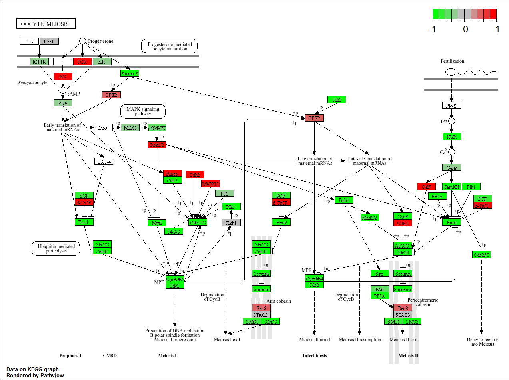

## Section 1. Differential Expression Analysis

```{r,warning=FALSE,message=FALSE}
library(DESeq2)

metaFile <- "GSE37704_metadata.csv"
countFile <- "GSE37704_featurecounts.csv"

# Import metadata and take a peek
colData = read.csv(metaFile, row.names=1)
head(colData)

# Import countdata
countData = read.csv(countFile, row.names=1)
head(countData)
```

Make sure the columns of countData match with rowNames of colData.

> Q. Complete the code below to remove the troublesome first column from countData

```{r}
# Note we need to remove the odd first $length col
countData <- as.matrix(countData[, colnames(countData) != "length"])
head(countData)
```

Remove entries with lots of zeros as we have no data for them.

> Q. Complete the code below to filter countData to exclude genes (i.e. rows) where we have 0 read count across all samples (i.e. columns).

```{r}
# Filter count data where you have 0 read count across all samples.
countData = countData[rowSums(countData) > 0, ]
head(countData)
```

### Running DESeq2

Nice now lets setup the DESeqDataSet object required for the DESeq() function and then run the DESeq pipeline. This is again similar to our last day's hands-on session.

```{r,warning=FALSE}
dds = DESeqDataSetFromMatrix(countData=countData,
                             colData=colData,
                             design=~condition)
dds = DESeq(dds)
dds
```

```{r}
res = results(dds)
```

> Q. Call the summary() function on your results to get a sense of how many genes are up or down-regulated at the default 0.1 p-value cutoff.

```{r}
summary(res)
```

### Volcano Plot

Now we will make a volcano plot, a commonly produced visualization from this type of data that we introduced last day. Basically it's a plot of log2 fold change vs -log adjusted p-value.

```{r,warning=FALSE}
library(ggplot2)


ggplot(res) +
  aes(x = log2FoldChange,
      y = -log10(padj)) +
  geom_point()
```

> Q. Improve this plot by completing the below code, which adds color, axis labels and cutoff lines:

```{r, warning=FALSE}
# Make a color vector for all genes
mycols <- rep("gray", nrow(res) )

# Color blue the genes with fold change above 2
mycols[ abs(res$log2FoldChange) > 2 ] <- "blue"

# Color gray those with adjusted p-value more than 0.01
mycols[ res$padj > 0.05 ] <- "gray"

ggplot(res) +
  aes(log2FoldChange,
      -log10(padj)) +
  geom_point(col = mycols) +
  xlab("Log2(FoldChange)") +
  ylab("-Log(P-value)") +
  geom_vline(xintercept = c(-2,2)) +
  geom_hline(yintercept = -log10(0.05))
```

### Adding gene annotation

> Q. Use the mapIDs() function multiple times to add SYMBOL, ENTREZID and GENENAME annotation to our results by completing the code below.

```{r, warning=FALSE}
library("AnnotationDbi")
library("org.Hs.eg.db")

columns(org.Hs.eg.db)

res$symbol = mapIds(org.Hs.eg.db,
                    keys=row.names(res), 
                    keytype="ENSEMBL",
                    column="SYMBOL",
                    multiVals="first")

res$entrez = mapIds(org.Hs.eg.db,
                    keys=row.names(res),
                    keytype="ENSEMBL",
                    column="ENTREZID",
                    multiVals="first")

res$name =   mapIds(org.Hs.eg.db,
                    keys=row.names(res),
                    keytype="ENSEMBL",
                    column="GENENAME",
                    multiVals="first")

head(res, 10)
```

> Q. Finally for this section let's reorder these results by adjusted p-value and save them to a CSV file in your current project directory.

```{r}
res = res[order(res$pvalue),]
write.csv(res, file="deseq_results.csv")
```

## Section 2. Pathway Analysis

We will use the gage package for pathway analysis, then visualize enriched pathways using pathview to color-code molecular up- and down-regulation. 

### KEGG pathways

Load the packages and setup the KEGG data-sets we need.

```{r, warning=FALSE,message=FALSE}
library(pathview)
library(gage)
library(gageData)

data(kegg.sets.hs)
data(sigmet.idx.hs)

# Focus on signaling and metabolic pathways only
kegg.sets.hs = kegg.sets.hs[sigmet.idx.hs]

# Examine the first 3 pathways
head(kegg.sets.hs, 3)
```

Supply gage() with a named vector of fold changes using the Entrez IDs (res$entrez) and DESeq2 results (res$log2FoldChange) mapped earlier.

```{r}
foldchanges = res$log2FoldChange
names(foldchanges) = res$entrez
head(foldchanges)
```
Now, let’s run the gage pathway analysis.

```{r}
# Get the results
keggres = gage(foldchanges, gsets=kegg.sets.hs)

attributes(keggres)
```

Like any list we can use the dollar syntax to access a named element, e.g. head(keggres$greater) and head(keggres$less).

Lets look at the first few down (less) pathway results:
```{r}
head(keggres$less)
```
Next, we will use pathview() to visualize our RNA-Seq results. We’ll start by manually providing a pathway.id, such as "hsa04110" (Cell cycle), identified in the previous step.

```{r}
pathview(gene.data=foldchanges, pathway.id="hsa04110")
```


Next, we will automatically extract the top five upregulated pathway IDs from our results and pass them to pathview() for plotting.

```{r,message=FALSE}
## Focus on top 5 upregulated pathways here for demo purposes only
keggrespathways <- rownames(keggres$greater)[1:5]

# Extract the 8 character long IDs part of each string
keggresids = substr(keggrespathways, start=1, stop=8)
keggresids

# Create pathview for the top 5 pathways
pathview(gene.data=foldchanges, 
         pathway.id=keggresids, 
         species="hsa",
         out.suffix="upregulated")
```

> Q. Can you do the same procedure as above to plot the pathview figures for the top 5 down-regulated pathways?

```{r,message=FALSE}
## Focus on top 5 downregulated pathways
keggrespathways_down <- rownames(keggres$less)[1:5]

# Extract the 8 character long IDs part of each string
keggresids_down = substr(keggrespathways_down, start=1, stop=8)

# Create pathview for the top 5 downregulated pathways
pathview(gene.data=foldchanges, 
         pathway.id=keggresids_down, 
         species="hsa", 
         out.suffix="downregulated")
```

Plots:




## Section 3. Gene Ontology (GO)

We can also do a similar procedure with gene ontology. Similar to above, go.sets.hs has all GO terms. go.subs.hs is a named list containing indexes for the BP, CC, and MF ontologies. Let’s focus on BP (a.k.a Biological Process) here.

```{r}
data(go.sets.hs)
data(go.subs.hs)

# Focus on Biological Process subset of GO
gobpsets = go.sets.hs[go.subs.hs$BP]

gobpres = gage(foldchanges, gsets=gobpsets)

lapply(gobpres, head)
```

## Section 4. Reactome Analysis

Reactome is a database of biological pathways and processes available via a web interface or the ReactomePA R package. 

We will now use our significant gene list (p < 0.05) to conduct over-representation and pathway-topology analysis. First, we will export these genes to a plain text file.

```{r}
sig_genes <- res[res$padj <= 0.05 & !is.na(res$padj), "symbol"]
print(paste("Total number of significant genes:", length(sig_genes)))

write.table(sig_genes, file="significant_genes.txt", row.names=FALSE, col.names=FALSE, quote=FALSE)
```

> Q: What pathway has the most significant “Entities p-value”? Do the most significant pathways listed match your previous KEGG results? What factors could cause differences between the two methods?

**Ans:** The pathway with the most significant Entities p-value in Reactome was Cell Cycle, Mitotic. The top five pathways were all related to mitotic progression and checkpoint control, indicating strong relation to cell division processes. Viewing the pathway names of the KEGG results, several pathways are also directly associated with the cell cycle and genome regulation, including Cell cycle, DNA replication, Homologous recombination, and Oocyte meiosis. These pathways are closely related to mitotic progression, DNA synthesis, and checkpoint regulation. KEGG also identified signaling pathways, however the dominant biological theme in both analysis highlighted cell proliferation and regulation. The KEGG and Reactome may be different because of their data scope. Reactome specializes in human molecular pathways, while KEGG covers a broader range of organisms and is more heavily used for metabolic and signaling pathways. Despite the differences, the main biological processes highlighted in both analyses are similar.


