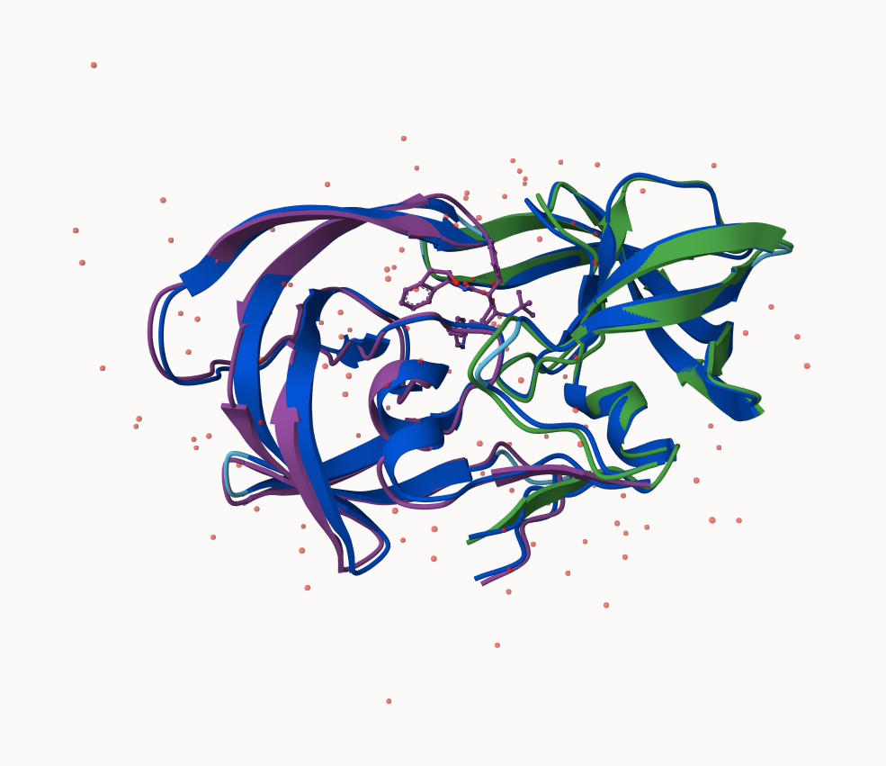

## Background

The main repo for biomolecular structure (PDB database) only has \~250,000 structures.

UNIProtKB (the main protein sequence database) has over 200 million entries!!!

## AlphaFold

## The EBI AlphaFold database

The EBI AlphaFold database contains a lot of computed structure models. It is increasingly likely that the strucure you are interested in is already in the database: <https://alphafold.ebi.ac.uk/>

There are 3 major outpus of AlphaFold:

1.  Model of the structure in PDB format

2.  A **PLDDT score**: tells us how confident the model is for a given residue in the protein

3.  A **PAE score**: tells us about protein packing quality

If you can't find the matching entry for the sequence you are interested in AFDB, you can run AlphaFold yourself.

## Running AlphaFold



## Interpreting Results

Custom analysis of reuslting models

We can read all the AlphaFold results into R and do more quantitative analysis than just viewing the structure in Mol*

Read all the PDB models:
```{r}
library(bio3d)

p <- read.pdb("hivpr_23119/hivpr_23119_unrelaxed_rank_001_alphafold2_multimer_v3_model_4_seed_000.pdb")
```

```{r}
#give path and file names
list.files("hivpr_23119/", pattern = ".pdb", full.names = T)
```
