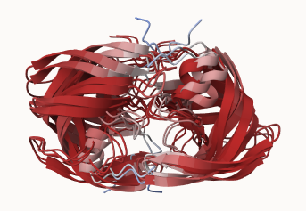
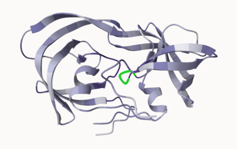

## Background

The main repo for biomolecular structure (PDB database) only has \~250,000 structures.

UNIProtKB (the main protein sequence database) has over 200 million entries!!!

## AlphaFold

By using the information contained in very large multiple sequence alignments (MSAs) as input features for AI approaches, AlphaFold2 was able to predict structures with unparalleled accuracy in recent CASP editions. AlphaFold2 employs deep learning techniques with physics based refinement to predict structures with accuracy similar to experimental results.

## The EBI AlphaFold database

The EBI AlphaFold database contains a lot of computed structure models. It is increasingly likely that the structure you are interested in is already in the database: <https://alphafold.ebi.ac.uk/>

There are 3 major outputs of AlphaFold:

1.  Model of the structure in PDB format

2.  A **PLDDT score**: tells us how confident the model is for a given residue in the protein

3.  A **PAE score**: tells us about protein packing quality

If you can't find the matching entry for the sequence you are interested in AFDB, you can run AlphaFold yourself.

## Running AlphaFold

After running AlphaFold with the HIV-Pr query sequence, we observed the pdb outputs with Mol*. After coloring by pLDDT confidence, we obtain the structure with the greatest confidence and superposition it with the 1HSG structure to confirm our findings.


## Interpreting Results

Custom analysis of resulting models

We can read all the AlphaFold results into R and do more quantitative analysis than just viewing the structure in Mol*

Read all the PDB models:
```{r}
library(bio3d)

p <- read.pdb("hivpr_23119/hivpr_23119_unrelaxed_rank_001_alphafold2_multimer_v3_model_4_seed_000.pdb")
```

```{r}
#give path and file names
pdb_files <- list.files("hivpr_23119/", pattern = ".pdb", full.names = T)

# Print our PDB file names
basename(pdb_files)
```


```{r}
#| result: hide
library(bio3d)

# Read all data from Models 
#  and superpose/fit coords
pdbs <- pdbaln(pdb_files, fit=TRUE, exefile="msa")
```

RMSD is a standard measure of structural distance between coordinate sets. We can use the rmsd() function to calculate the RMSD between all pairs models.

```{r}
#| warning: false
rd <- rmsd(pdbs, fit=T)
range(rd)
```

Heatmap of RMSD matrix values:

```{r}
library(pheatmap)

colnames(rd) <- paste0("m",1:5)
rownames(rd) <- paste0("m",1:5)
pheatmap(rd)
```

Now lets plot the pLDDT values across all models. Recall that this information is in the B-factor column of each model and that this is stored in our aligned pdbs object as pdbs$b with a row per structure/model.

```{r}
# Read a reference PDB structure
pdb <- read.pdb("1hsg")
```

Optionally obtain secondary structure from a call to stride() or dssp() on any of the model structures.

```{r}
plotb3(pdbs$b[1,], typ="l", lwd=2, sse=pdb)
points(pdbs$b[2,], typ="l", col="red")
points(pdbs$b[3,], typ="l", col="blue")
points(pdbs$b[4,], typ="l", col="darkgreen")
points(pdbs$b[5,], typ="l", col="orange")
abline(v=100, col="gray")
```

Use `core.find()` to improve the superposition/fitting of our models by finding the most consistent “rigid core”

```{r}
#| results: hide
core <- core.find(pdbs)

#write out fitted structures to corefit_structures
core.inds <- print(core, vol=0.5)
xyz <- pdbfit(pdbs, core.inds, outpath="corefit_structures")
```

The resulting superposed coordinates are written to a new director called corefit_structures/. We can now open these in Mol* and color by the Atom Property of Uncertainty/Disorder



Now we can examine the RMSF between positions of the structure. RMSF is an often used measure of conformational variance along the structure:

```{r}
rf <- rmsf(xyz)

plotb3(rf, sse=pdb)
abline(v=100, col="gray", ylab="RMSF")
```

### Predicted Alignment Error for domains

AlphaFold produces an output called Predicted Aligned Error (PAE). Below we read these files and see that AlphaFold produces a useful inter-domain prediction for model 1 (and 2) but not for model 5 (or indeed models 3, 4, and 5):

```{r}
library(jsonlite)
results_dir <- "C:/Users/huber/Downloads/BIMM 143/class11/hivpr_23119"

# Listing of all PAE JSON files
pae_files <- list.files(path=results_dir,
                        pattern=".*model.*\\.json",
                        full.names = TRUE)

pae1 <- read_json(pae_files[1],simplifyVector = TRUE)
pae5 <- read_json(pae_files[5],simplifyVector = TRUE)

attributes(pae1)

# Per-residue pLDDT scores 
#  same as B-factor of PDB..
head(pae1$plddt) 

# Max PAE vals useful for ranking
pae1$max_pae
pae5$max_pae
```

We can plot the N by N (where N is the number of residues) PAE scores with ggplot or with functions from the Bio3D package:

```{r}
plot.dmat(pae1$pae, 
          xlab="Residue Position (i)",
          ylab="Residue Position (j)")
```

```{r}
plot.dmat(pae5$pae, 
          xlab="Residue Position (i)",
          ylab="Residue Position (j)",
          grid.col = "black",
          zlim=c(0,30))
```

We should really plot all of these using the same z range. Here is the model 1 plot again but this time using the same data range as the plot for model 5:

```{r}
plot.dmat(pae1$pae, 
          xlab="Residue Position (i)",
          ylab="Residue Position (j)",
          grid.col = "black",
          zlim=c(0,30))
```

### Residue conservation from alignment file

```{r}
aln_file <- list.files(path=results_dir,
                       pattern=".a3m$",
                        full.names = TRUE)
aln <- read.fasta(aln_file[1], to.upper = TRUE)

# Num seq in alignment
dim(aln$ali)
```

We can score residue conservation in the alignment with the conserv() function.

```{r}
sim <- conserv(aln)
plotb3(sim[1:99], sse=trim.pdb(pdb, chain="A"),
       ylab="Conservation Score")
```

Note the conserved Active Site residues D25, T26, G27, A28. These positions will stand out if we generate a consensus sequence with a high cutoff value:

```{r}
con <- consensus(aln, cutoff = 0.9)
con$seq
```

For a final visualization of these functionally important sites we can map this conservation score to the Occupancy column of a PDB file for viewing in molecular viewer programs such as Mol*, PyMol, VMD, chimera etc.

```{r}
m1.pdb <- read.pdb(pdb_files[1])
occ <- vec2resno(c(sim[1:99], sim[1:99]), m1.pdb$atom$resno)
write.pdb(m1.pdb, o=occ, file="m1_conserv.pdb")
```


